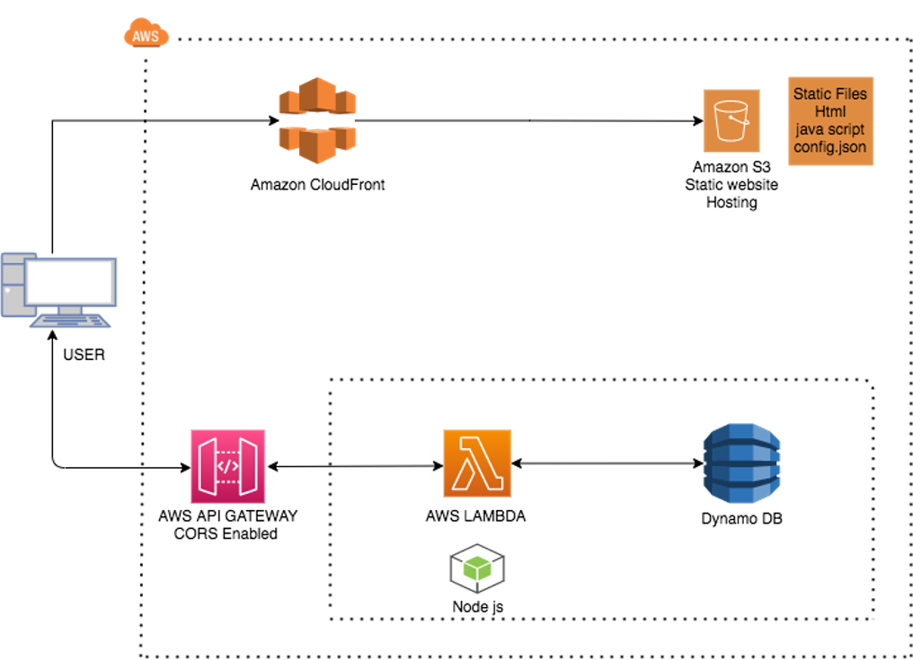
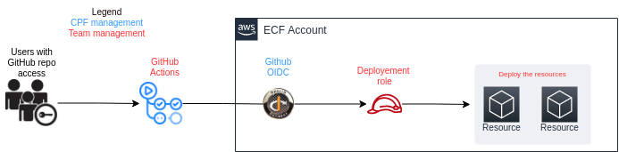

# startup-sample-project-aws-serverless-OIDC

Lambda serverless app meant to accelerate teams onboarding to the BC Gov SEA AWS space.
This repository use [Github OpenID Connect](https://docs.github.com/en/actions/deployment/security-hardening-your-deployments/configuring-openid-connect-in-amazon-web-services) to authenticate directly to AWS assuming an IAM role.

## Applicatition Architecture

.

## How GitHub Actions authenticates with AWS



## How to use this repository to deploy your own app

- Fork this repo
- Enable github actions
- configure github variables

### Github Variables

The GitHub actions require the following github variables:

- `LICENSEPLATE` is the 6 character alphanumeric string  associated with your project set e.g. `abc123` (Note: due to AWS constrains it is required the first characters is a letter)
- `S3_BACKEND_NAME` is the name of the S3 Bucket name used to store the Terraform state.
- `TERRAFORM_DEPLOY_ROLE_ARN` This is the ARN of IAM Role used to deploy resources through the Github action authenticate with the GitHub OpenID Connect. You also need to link that role to the correct IAM Policy.

- To access the `TERRAFORM_DEPLOY_ROLE_ARN` you need to create it beforehand manually. To create it you need can use this example of thrust relationship :
- The [minimal access policy can be found here](resources/deployement-policy.json) (Note: in the policy examples `<account-id>` has to be replaced by the AWS account id of the account where you are deploying the sample app)
- The role requires to have the following trust relationship set up  (Note: as before `<account-id>` has to be replaced by the AWS account id of the account where you are deploying the sample app)

```json
{
"Version": "2012-10-17",
"Statement": [
    {
        "Effect": "Allow",
        "Principal": {
            "Federated": "arn:aws:iam::<accound_id>:oidc-provider/token.actions.githubusercontent.com"
        },
        "Action": "sts:AssumeRoleWithWebIdentity",
        "Condition": {
            "StringLike": {
                "token.actions.githubusercontent.com:sub": "repo:<Github_organization>/<repo_name>:ref:refs/heads/<Your_branch>"
            },
            "ForAllValues:StringEquals": {
                "token.actions.githubusercontent.com:iss": "https://token.actions.githubusercontent.com",
                "token.actions.githubusercontent.com:aud": "sts.amazonaws.com"
            }
        }
    }
]

}

  ```

- Once the app has been built, you should be able to log into AWS with your IDIR account (2FA may be implemented). Once logged in AWS search for Cloudfront and then click on Distributions (If you can not see it click the hamburger on the top left corner). The Distributions dashboard shows the Domain name url, you can use that url to open a browser session and load the app.

## Github Action Workflows

### Deploy

[.github/workflows/deploy.yml](.github/workflows/deploy.yml)

The deploy workflow is triggered by manual dispatch. It will deploy the selected branch to the selected environment.

>NOTE: For this sample application we chose a manual deploy workflow to keep the cost down. In a real world scenario you may want to use an automated workflow.

### Destroy

[.github/workflows/destroy.yml](.github/workflows/destroy.yml)

The destroy workflow is triggered by manual dispatch. It will destroy the selected branch from the selected environment.

### Pull Request

[.github/workflows/pull_request.yml](.github/workflows/pull_request.yml)

The pull request workflow is triggered by pull request to any of the `dev`, `test`, or `main` branches. It will run a `terraform plan` and build the frontend.
